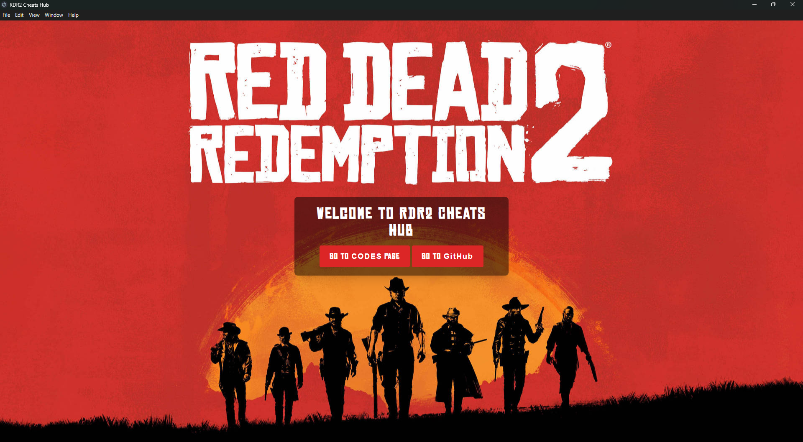
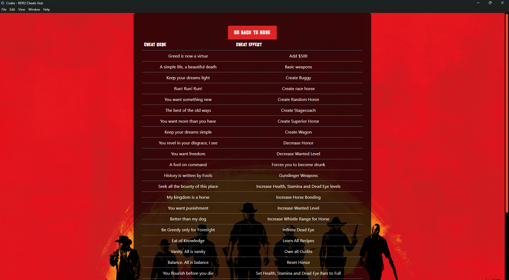

# RDR2 Cheats Hub

RDR2 Cheats Hub is an Electron-based desktop application designed to provide quick access to cheat codes for **Red Dead Redemption 2 (RDR2)**. The app features a clean and user-friendly interface to browse and use cheat codes effortlessly.

---

## Features

- **Browse Cheat Codes:** A categorized list of all RDR2 cheat codes, along with their effects.
- **Simple Navigation:** Switch between the home and cheat codes page with ease.
- **Modern Design:** Inspired by the aesthetics of Red Dead Redemption 2.
- **Offline Support:** Access cheat codes without an internet connection.
- **Free and Open-Source:** Download and contribute on GitHub.

---

## Installation

1. Download the latest release of **RDR2 Cheats Hub** from the link below:
   [Download RDR2 Cheats Hub Setup v1.0.0](https://github.com/jasurhaydarovcode/RDR2-Cheats-Hub/releases/download/v1.0.0/RDR2.Cheats.Hub.Setup.1.0.0.exe)

2. Run the installer and follow the setup instructions.

3. Launch the app and start exploring cheat codes for RDR2.

---

## Screenshots

### Home Screen

### Cheat Codes Page

---

## Technologies Used

---

## How to Use

1. Launch the **RDR2 Cheats Hub** application.
2. Use the home screen to navigate to the "Codes Page."
3. Browse through the cheat codes and effects.
4. Use the back button to return to the home page.

---

## Contributing

We welcome contributions to improve **RDR2 Cheats Hub**. Here's how you can contribute:

1. Fork the repository.
2. Create a new branch: `git checkout -b feature/YourFeatureName`.
3. Make your changes and commit them: `git commit -m 'Add some feature'`.
4. Push to the branch: `git push origin feature/YourFeatureName`.
5. Submit a pull request.

---

## License

This project is licensed under the [MIT License](https://opensource.org/licenses/MIT).

---

## Contact

For support or inquiries, please contact:

- **Author:** Jasur Haydarov
- **GitHub:** [jasurhaydarovcode](https://github.com/jasurhaydarovcode)

---

Enjoy exploring the Wild West with **RDR2 Cheats Hub**! 🎮
